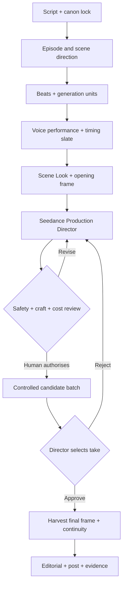

# World-class animation pipeline contract

Version: 2.0 canonical recovery, 27 July 2026

## Intended result

Script in; directed, reference-accurate, performed animation out. The system protects
creative intent and production truth before a probabilistic model receives a request.
“World-class” here means world-class production discipline, observability and control. The
human director still decides whether the work is genuinely good.

## Production architecture

## Objects remain distinct

| Object | Meaning | Owns |
|---|---|---|
| Scene | Dramatic unit | purpose, geography, emotional change |
| Beat | Story, emotion or comedy change | anticipation, turn, payoff |
| Generation unit | One paid Seedance request | duration, opening state, ordered references, audio |
| Cinematic shot | One camera view inside a generation unit | lens, framing, camera, causal action, landing |

For backwards compatibility, existing package IDs still use `shotId` for the generation
unit. Its approved Animation direction now carries a `shotPlan` of one to three cinematic
shots. The distinction is explicit without breaking existing production history.

## Director output

The Seedance Production Director returns structured production intent before prose:

- dramatic beat and performance arc;
- physical cause and effect;
- timing and rhythm;
- one-to-three-shot plan with motivated camera and edits;
- separate reference contract with asset role and scope;
- exact continuity landing;
- no more than three surgical safeguards;
- one concise, paste-ready provider shooting script.

Dialogue is the deliberate exception to generic video-prompt practice: spoken words never
appear in the visual prompt. `@Audio1` alone owns exact words, voice, performance and timing.
Only the named speaker's mouth moves; listeners remain silent.

## Direct-input lineage

Approved Animation direction is signed against:

- package revision and shot contract;
- approved opening-frame bytes;
- approved Scene Look hash;
- exact reference order and every reference file hash;
- approved voice file hash and voice-approval signature.

Changing any one of those inputs marks the direction stale. The production preflight names
the stale stage and stops it being treated as current direction.

The timing slate has its own contract containing package revision, shot durations, locked
dialogue hashes, approved voice paths, voice hashes and voice-approval signatures. A changed
performance or duration visibly marks the slate stale.

## Free preflight before spend

The structure-and-craft check makes zero provider calls and returns:

- provider blockers: billing, opening frame, Scene Look, ordered references, voice;
- the exact prompt source and final prompt;
- the ordered provider reference contract with content hashes;
- duration, model, resolution and aspect ratio;
- a 20-point craft score.

The ten craft dimensions are story beat, canon/references, physical cause-and-effect,
camera/edit, observable performance, composition/depth, light/materials/finish,
dialogue/audio separation, continuity landing and prompt economy.

Target: **17/20**, with no zero in story, canon, dialogue/audio separation or continuity.
This remains advisory. Missing required production inputs and dialogue leakage are hard
blockers; artistic judgement remains human.

## Spend and approval model

Every paid action follows:

1. validate current package and direct inputs;
2. show exact approved prompt, references, audio, model, candidate count and maximum cost;
3. issue a server-side, single-use token bound to that request;
4. generate only the authorised batch;
5. persist partial success so a retry never repays completed candidates;
6. stop for human selection;
7. archive rejected/superseded work and preserve evidence.

Two rejected unchanged batches make the unit model-limited. The system then requires human
redesign or another production method rather than endless prompt patching.

## Governed render-learning loop

Every keyframe, animation candidate and assembled scene can be reviewed against the approved
intention. Director Review scores beat delivery, acting, physical causality, timing and
reaction, camera/edit, composition/continuity, reference fidelity and finish. It separates
visible evidence from inference, names the likely root cause and states its confidence.

The next action follows a cheapest-first hierarchy:

1. approve the successful take;
2. select a stronger candidate already generated;
3. recover the take in edit;
4. revise a free upstream artefact;
5. paid rerender with one changed lever only;
6. return to human redesign when the unit is structurally overloaded.

A rerender recommendation is incomplete unless it states what must remain unchanged and
the observable evidence that would prove the single tweak worked. Human decisions and the
structured diagnosis enter the append-only Evidence Library. They do not silently rewrite
prompts or become active rules. Repeated evidence may become a proposed pattern; only an
explicit human-approved, versioned source change can activate it.

## Definition of done

A scene is done only when:

- script and canon are unchanged or deliberately revised;
- every direct media input is current and approved;
- every generated unit has one human-selected take;
- every handoff has a usable harvested final frame;
- continuity review has inspected actual media, not just prompts;
- the scene picture and sound are assembled;
- the evidence pack records inputs, provider requests, outputs, costs and decisions.
