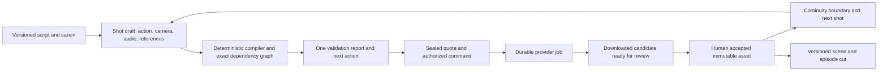

# AI Studio: production reliability and simplification audit

7 September 2026 · Current Desktop Studio checkout · Episode 2 production evidence

## Decision

The Studio can produce work Julian wants to approve. Episode 2's final shot is a concrete example. The principal software problem is that an accepted production decision does not have one stable representation across the compiler, readiness service, job runner and interface.

The next investment should be a consolidation release: one production state model, one typed prompt compiler, one provider-job lifecycle and one next-action service. Adding another agent, quality score, doctrine document or exception for a particular shot will deepen the existing problem.

This audit does not claim competitive superiority. A leading studio needs measurable reliability, excellent creative controls and a repeatable finished-film workflow. Those are the proposed acceptance criteria below.

## Scope and verified baseline

- Inspected the live checkout, retained SQLite job history, all eight current Episode 2 production packages, approval/media integrity, readiness computation, prompt compilation/validation, runtime safety installation, source reload, provider submission, scene navigation, post entry points and relevant tests.
- Ran the full repository test suite: **1,007 passed, 5 failed, 4 skipped in 58.11 seconds**; 1,016 tests collected. This is not a clean release baseline.
- All **19 shot ledgers** record approved takes. All 19 take hashes and harvested-frame hashes match their recorded approvals. All eight package lineage reports are current.
- Nevertheless, the current readiness calculation gives **all 19 shots** the headline **“Waiting for the scene world.”** Scene 8 simultaneously reports two approved takes ready in Director's Seat and an upstream animation lock.
- Retained job history: **468 jobs: 245 done, 194 failed, 20 interrupted, 9 stopped**, spanning 1 August–7 September 2026. This is a mixed-operation history, not 468 renders. Approval pauses, old defects, provider errors and deliberate stops must not be combined into a render-success statistic.
- The checkout already contains extensive uncommitted production and source changes. This audit adds its own report and read-only evidence tool; it does not rewrite production code, invalidate approvals, regenerate media, or reconcile existing edits.

Evidence: [machine-readable snapshot](2026-09-07-production-evidence.json) and [test results](2026-09-07-test-summary.txt). Reproduce using `python3 tools/audit_studio_production.py --output /tmp/studio-audit.json` from the Studio root. The captured run verified that production-package bytes were unchanged.

Limits: this covers the retained local history, not every historical conversation or every discarded job. It is a software and workflow audit, not a fresh artistic review of every clip, a browser interaction certification, a penetration test, or a live paid-provider benchmark. Code-path risks below are distinguished from reproduced failures.

## Findings, in implementation order

### A01 · High · Accepted media and new-generation readiness are conflated

**Observed.** Nineteen approved, hash-intact takes coexist with nineteen “Waiting for the scene world” labels. In `cb_state._shot_state`, scene-world gating precedes the visible outcome label. `cb_safety.animation_approval_status` also recomputes a current generation signature and falls back to a second definition of direct-input validity. Historical acceptance and current draft buildability are different questions but share status decisions.

Sources: [readiness branches](</Users/julianjenkins/Desktop/Ai Studio/engine/cb_state.py:265>), [approval evaluation](</Users/julianjenkins/Desktop/Ai Studio/engine/cb_safety.py:1102>).

**Replace with:** an immutable accepted asset revision, a separately editable draft revision, and explicit usage decisions. Display “Approved take” whenever that exact accepted asset is intact. If a new script requires a replacement, show “Approved earlier version; replacement needed for current cut,” with a precise reason. Reopening a draft must never make the accepted clip disappear or imply that it was never approved.

**Acceptance:** opening any of the 19 current shots shows the actual accepted take. Changing a future shot does not request review of an earlier unchanged clip. A genuine content change flags affected uses without rewriting the old approval.

### A02 · High · Invalidation is scoped in some paths and broad in others

**Reproduced.** Incrementing only `package.revision` changes `_seedance_working_input_signature`. The department signature explicitly excludes that same revision. The working signature also includes almost the entire shot dictionary, while other paths have scoped signatures and compatibility exceptions.

Source: [working prompt signature](</Users/julianjenkins/Desktop/Ai Studio/engine/cb_render.py:7644>), [department signature](</Users/julianjenkins/Desktop/Ai Studio/engine/cb_safety.py:275>).

The retained failures include nine stale Cinematography-direction refusals, four stale Animation-direction refusals under the direct-input message, four stale spend-token refusals and three stale working-WATCH refusals. Some were legitimate; the log alone cannot establish that all were false positives.

**Replace with:** one dependency specification for each artifact type. Hash the actual consumed content and ordered asset bindings. Keep package counters, notes, timestamps and audit history outside content validity. Store compiler/skill version as provenance; upgrading software should invalidate a cached build only when its declared contract requires rebuilding, not revoke an accepted picture.

**Acceptance:** a change-impact preview lists exact affected artifacts and reasons. A note-only edit changes none. Dialogue changes HEAR and dependent WATCH; a camera change does not regenerate voice. A changed predecessor landing flags downstream continuity use. New billing settings require a new quote without invalidating media.

### A03 · High · Prompt text checks reject valid direction and can rewrite meaning

**Reproduced:**

1. “The music reaches a tonic resolution” matches the forbidden request-parameter regex.
2. Two descriptions of the same 18–26-second interval, one for camera and one for music, are parsed as sequential ranges and rejected as overlapping.
3. “18–26 seconds” changed to “18 seconds until 26 seconds” fails the literal visual-event match in a minimal reproduction.

**Code evidence:** `strip_prompt_request_parameters` globally turns “resolution” into “composition,” and “no cuts” into “motivated transitions only.” The former appeared in this shot's compiled music wording. The latter is a materially different camera instruction; its presence is a latent semantic-rewrite risk, not evidence that this final render suffered an unwanted cut.

Sources: [parameter regex](</Users/julianjenkins/Desktop/Ai Studio/engine/cb_prompt_lab.py:147>), [timing validation](</Users/julianjenkins/Desktop/Ai Studio/engine/cb_prompt_lab.py:861>), [story-text lock](</Users/julianjenkins/Desktop/Ai Studio/engine/cb_departments.py:1176>), [rewriting](</Users/julianjenkins/Desktop/Ai Studio/engine/cb_departments.py:2061>).

**Replace with:** typed action, camera, audio and dialogue timelines; stable event IDs; a deterministic compiler that emits each approved event once; and a request object containing provider settings. Validate timeline channels independently. Parallel audio and camera events are valid. Preserve exact spoken words. Validate event coverage from the compiler's source map rather than searching the final prose for an identical sentence.

**Acceptance:** all three reproductions pass; a missing event or altered dialogue still blocks. A continuous-shot direction survives compilation unchanged. The composer can write “tonic resolution” without renaming musical terminology to satisfy code.

### A04 · High · Quality heuristics act as mandatory production gates

**Observed in code.** The 17/20 completeness threshold and 9.5/10 authoring floor can block provider execution. Several dimensions reward the presence of words such as “because,” “wide,” “warm” and “reaction.” `promptEconomy` uses safeguard count, even though a word count is computed; it does not establish prompt economy. Scores are sometimes also labelled “creative.”

Sources: [score implementation](</Users/julianjenkins/Desktop/Ai Studio/engine/cb_render.py:7863>), [fire-time enforcement](</Users/julianjenkins/Desktop/Ai Studio/engine/cb_render.py:7027>).

**Replace with:** a small hard-invariant report plus advisory creative notes. A missing audio file, wrong speaker, absent required reference or impossible duration is a blocker. Phrase preference, prompt length recommendations, camera vocabulary and an estimated comedy score are warnings. Genuine provider request-size limits remain hard constraints.

**Acceptance:** removing the word “because” cannot stop a structurally valid shot. Each hard blocker names the violated fact and offers one concrete repair. Human media review remains the artistic decision.

### A05 · High · Submission retries need a different policy from polling retries

**Code-path risk; duplicate billing not established by this audit.** BytePlus task creation calls `_rpost`, which uses the generic retry policy. Connection errors and timeouts are retryable. A server can accept a paid creation request while its response is lost; automatically repeating that POST may create another job unless the provider supplies an effective idempotency mechanism. Local spend claims do not prevent multiple HTTP attempts inside one claimed submission.

Sources: [retry classification](</Users/julianjenkins/Desktop/Ai Studio/engine/cb_gen.py:107>), [POST wrapper](</Users/julianjenkins/Desktop/Ai Studio/engine/cb_gen.py:149>), [task creation](</Users/julianjenkins/Desktop/Ai Studio/engine/cb_gen.py:314>).

**Replace with:** operation-specific transport policy. Retry status reads/downloads. For ambiguous paid creation, use documented provider idempotency if available; otherwise record `submission_unknown` and reconcile before another submission. Verify provider support during implementation rather than inventing an idempotency header.

**Acceptance:** simulate “provider accepted; response timed out.” The application makes no second paid submission without reconciliation or a new explicit decision.

### A06 · High · Durable provider IDs exist, but the normal resume path is incomplete

**Observed in code/history.** Provider task IDs and progress events are persisted, which is a strong foundation. However, the generation function starts by creating a task; it has no existing-task resume argument. Local candidate claims correctly block an unresolved attempt, but the normal UI path does not therefore become a reconnect-and-download path. Thirteen retained jobs explicitly say the Studio restarted before completion.

Sources: [saved provider progress](</Users/julianjenkins/Desktop/Ai Studio/engine/cb_render.py:9630>), [unresolved claim](</Users/julianjenkins/Desktop/Ai Studio/engine/cb_db.py:650>), [provider lifecycle](</Users/julianjenkins/Desktop/Ai Studio/engine/cb_gen.py:253>).

**Replace with:** a durable job record separating submission, provider execution, download, audio restoration, review-ready and approval. Startup reconciliation should attach to an existing provider task and finish local work. Store credential identity/version on the job so rotation does not strand an active task; never store the key in its visible log.

**Acceptance:** restart the UI/server during a mocked running task, then finish with the same provider ID and one charge. A download interruption resumes download. Provider completion alone does not trigger “ready to watch.”

### A07 · Medium · An expected spend decision is reported as failure on the comparison route

**Observed and exact.** `_stream` recognizes `SPEND NOT APPROVED` as a normal outcome for `shot:fire` and `shot:edit`, but omits `shot:compare-fire`. The first comparison attempt for the approved finale consequently appeared as failed even though it correctly issued the quote. Sixteen retained failures have the normalized spend-approval message.

Source: [outcome classification](</Users/julianjenkins/Desktop/Ai Studio/cb-studio/serve.py:1099>).

**Replace with:** structured command outcomes (`needs_spend_approval`, `needs_media_review`, `blocked`, `running`, `failed`) across all operations. Stop parsing human log strings to infer the application's state. The database must store the same vocabulary.

**Acceptance:** fire, compare, edit and credits all present a quote as a decision, not an error. One authorized bounded request remains one candidate by default; no extra approval is required merely because the UI changes stage.

### A08 · High · Runtime policy is installed through hidden function replacement

**Observed.** `cb_render.py` contains 11,399 lines; `cb_safety.py` adds 2,139 and replaces many functions at import time; `cb_transactions.py` wraps a manually maintained operation list. Reading the visible function body is insufficient to know the behaviour actually called. Compatibility names containing “approved” now mean current machine direction. `_require_current_lineage` describes a hard refusal but returns a report; the safety wrapper supplies additional checks elsewhere.

The lease list also omits newer mutation functions such as `reopen_approved_shot`, `set_continuity_mode`, `bind_animation_location_reference` and `import_animation_candidate`. This is inconsistent scene-lock coverage, not proof that a race has already corrupted data. Atomic document writes are useful and should be retained; they do not make an entire multi-file operation transactional.

Sources: [installation](</Users/julianjenkins/Desktop/Ai Studio/engine/cb_render.py:11229>), [replacement table](</Users/julianjenkins/Desktop/Ai Studio/engine/cb_safety.py:2094>), [mutation list](</Users/julianjenkins/Desktop/Ai Studio/engine/cb_transactions.py:10>), [atomic write](</Users/julianjenkins/Desktop/Ai Studio/engine/cb_db.py:278>).

**Replace with:** explicit application services and one command transaction boundary. Move rules into named policy functions called directly, not monkey-patched replacements. Register commands with their scope and effects. Add crash recovery for multi-file transitions; SQLite and filesystem replacement are not one atomic transaction.

**Acceptance:** every public mutation is covered by one registry test. Two competing commands for the same scene cannot partially interleave. Reviewers can trace one command without discovering hidden wrappers.

### A09 · Medium · “Fresh code” has several mechanisms and no single build identity

**Observed.** The server watches its own mtime; a helper reloads individual engine modules; other handlers import engine modules normally; generation uses fresh subprocesses. A module reload does not necessarily reload all its dependencies. Subprocesses are launched through the PATH name `python3`, while the server itself has a known interpreter. Three retained jobs report missing `pydantic`.

Sources: [module reload helper](</Users/julianjenkins/Desktop/Ai Studio/cb-studio/serve.py:51>), [freshness guard](</Users/julianjenkins/Desktop/Ai Studio/cb-studio/serve.py:204>), [worker launch](</Users/julianjenkins/Desktop/Ai Studio/cb-studio/serve.py:1063>).

**Replace with:** a declared runtime/build version and one configured interpreter. Requests, workers, UI and compiled artifacts report their version. Restart idle workers deliberately when their build changes. Do not interrupt provider jobs to refresh UI code. Keep the existing fresh `.env` load for subprocesses, which supports credential updates without embedding secrets in packages.

**Acceptance:** a changed compiler dependency is either loaded consistently or clearly awaits a safe restart. No handler mixes an old policy module with a new compiler. Runtime health checks verify required imports before a production command starts.

### A10 · Medium · Active-shot selection and next-action rules are duplicated

**Observed in code.** `cb_state._active_package_shots` excludes superseded/archived/skipped units. `cb_render.next_shot` loops directly over `pkg['shots']`; the safety stitch wrapper also loops over that raw list. Current Episode 2 has no retired rows in those packages, so this is a latent disagreement rather than a current stuck shot. The browser separately computes prerequisite stages, next stages and next-scene buttons.

Sources: [active units](</Users/julianjenkins/Desktop/Ai Studio/engine/cb_state.py:620>), [render walk](</Users/julianjenkins/Desktop/Ai Studio/engine/cb_render.py:10256>), [browser navigation](</Users/julianjenkins/Desktop/Ai Studio/cb-studio/app.html:3175>).

**Replace with:** one ordered production graph and a server-provided next action. A moving continuation consumes its predecessor's accepted video; an ordinary handoff consumes its approved ending state; a new scene gets its own opening decision. Do not impose a continuous relay across an intentional scene cut. Prepare independent future work while waiting for a predecessor, but do not spend on dependent WATCH with an unapproved boundary.

**Acceptance:** approve → next relevant shot; final shot → scene review; scene review → next scene; episode end → post/credits. Splitting or retiring a unit changes this graph once, consistently across UI, rendering and editorial.

### A11 · Medium · Old doctrine, current rules and historical repair instructions are mixed

**Observed.** README advertises port 8765, an old expected test count and dialogue never appearing in the visual prompt. The actual final shot uses exact braced dialogue markers and sole approved-audio authority. The definitive pipeline establishes document precedence, but older root documents still contain detailed operational instructions. History is valuable; presenting it as current procedure is not.

Sources: [README](</Users/julianjenkins/Desktop/Ai Studio/README.md:1>), [precedence](</Users/julianjenkins/Desktop/Ai Studio/THE_DEFINITIVE_PIPELINE.md:10>), [compiled finale](../../cb-output/creative/Ep2_S8.SH2_30s_flight_finale_WATCH_compiled.txt).

**Replace with:** one short current operating contract, a machine-readable rule registry, and a clearly separated historical archive. Every rule has an owner, scope, severity, reason, version and regression case. Shot-specific fixes belong to that shot's revision, not a permanent show-wide instruction. Update repository entry points to identify the actual application; root Node scripts still describe the older unrelated project.

**Acceptance:** a new operator can start the correct Studio and complete one shot from the current guide without consulting old numbered rules. Retired policy cannot be loaded into active department instructions.

### A12 · Medium · Tests have drifted alongside the application

The five failures are not five demonstrated production defects:

| Test | Observed failure | Required resolution |
|---|---|---|
| `test_fire_prepares_internal_direction_then_returns_to_the_visible_outcome` | Expects literal `Fire candidates` HTML | Test the intended user action and outcome, not obsolete button text |
| `test_keyframe_prompt_contract_detects_record_tampering` | Empty REFERENCE AUTHORITY before intended assertion | Supply a valid reference fixture, then prove tampering is detected |
| `test_uploaded_watch_render_becomes_zero_spend_pending_candidate` | Two-argument mock called with three arguments | Update fixture interface and retain the zero-spend import assertion |
| `test_golden_path_package_to_approved_scene_master` | Empty REFERENCE AUTHORITY for a relay fixture | Reconcile relay reference contract and test full scene completion |
| `test_single_seedance_call_graph` | Credits add a second valid provider caller | Enforce the shared authorized submission service, not exactly one source-text call site |

The suite already provides valuable mocked generation, canon, billing and state coverage. Do not delete failing tests just to produce a green number. Preserve each intended invariant and replace historical implementation assumptions.

## Rules that should remain hard, and rules that should stop interrupting production

| Concern | Enforcement | User experience |
|---|---|---|
| Exact script dialogue, speaker and approved audio binding | Hard | Explain the specific mismatch and affected line |
| Required reference identity, existence, content hash and upload order | Hard | Repair a missing binding; never silently substitute |
| Approved media bytes/approval provenance | Hard | Show intact accepted work; quarantine changed bytes |
| Provider-supported request limits and formats | Hard | Resolve before quote; do not discover limits after spend |
| Authorized cost/candidate count, duplicate submission protection | Hard | One clear quote/authorization for the exact request |
| Required predecessor continuity for a dependent render | Hard | Show which approved boundary is needed |
| Draft notes, audit timestamps and package counters | Not validity inputs | No regeneration or reapproval |
| Prompt vocabulary, recommended length, inferred artistic score | Advisory | Director note; no technical dead end |
| Approved-but-older material after a deliberate story edit | Usage impact, not revoked history | Identify where replacement is needed |
| Skill/compiler update | Versioned migration policy | Rebuild drafts only when necessary; retain old approvals |
| Repeated prose / formatting normalization | Deterministic compiler responsibility | Fix automatically without changing the direction |
| Creative change to a locked shot | New revision with scoped review | Keep the approved version available for comparison |

The principle is simple: the software handles bookkeeping and mechanical preparation; Julian judges the things he can see and hear. Never weaken dialogue, identity, human acceptance or spend integrity to compensate for a stale-state bug.

## Proposed production architecture

These are logical responsibilities, not a requirement for distributed services. A modular local application is enough. Retain the current SQLite foundation, local media store, content hashes, provider adapters and review UI. The important change is explicit ownership and shared semantics.

**Core records:** `ShotRevision`, `AssetRevision`, `Approval`, `Dependency`, `RenderRequest`, `ProviderJob`, `CutRevision`, `RuleDefinition`, `ProductionAction`. Each acceptance refers to exact bytes and a revision. Each cut refers to accepted asset IDs rather than whichever file happens to have a conventional filename.

**Production screen:** scene/shot, the current accepted artifact, the working draft if one exists, one next action, and concise reasons. Optional technical details expand on demand. “Stale” alone is never adequate information. Say, for example, “Fuzzby's final line changed; this draft needs new audio. The previous accepted take remains available.”

**Retake flow:** select the accepted take → describe change → see affected inputs → prepare revised inputs → review changed media → authorize WATCH → compare → accept. A body-only correction preserves audio. A changed spoken line rebuilds affected audio. A changed ending invalidates dependent boundary uses, not the entire episode.

**Post flow:** approved shots are necessary but not sufficient for a finished episode. Keep scene-cut approval, boundary review, loudness/mix, titles/credits and final-master acceptance as explicit editorial milestones. A new S8.SH2 acceptance should flag any cut using the superseded take as needing reconform, not mark the episode complete.

## Implementation plan with exit criteria

| Stage | Deliverable | Completion evidence |
|---|---|---|
| 1. Establish a release baseline | Classify the existing dirty checkout; preserve the 19 approved assets and source revisions; repair the five test contracts | Full suite clean; zero approval/media drift; reproducible launch |
| 2. Unify accepted assets and draft validity | A01/A02 state model and change-impact report, initially compared alongside existing readiness | All eight scenes show the correct accepted work; unrelated changes cause zero new review requests |
| 3. Consolidate compiler and rule policy | A03/A04 typed timeline and event coverage; hard/advisory registry | Three grammar reproductions fixed; exact dialogue and missing-reference tests still refuse correctly |
| 4. Make jobs recoverable | A05/A06/A07 lifecycle and typed outcomes | Lost-response, restart, interrupted-download and quote flows pass with one authorized submission |
| 5. Simplify commands and handoffs | A08/A09/A10 explicit services, one interpreter/build and production graph | Same actions and results through UI/API/CLI; no shot-specific repair script needed for a test episode |
| 6. Retire old policy and finish editorial integration | A11/A12 documentation, behaviour tests and cut revision tracking | Fresh-operator run from script through final master; current guide alone is sufficient |

Migrate one responsibility at a time behind compatibility adapters. Compare new readiness with current snapshots before switching the UI. Do not normalize old production packages in place merely to fit a new schema. Import accepted assets with their original evidence and preserve a reversible migration map. A future release rollback should restore the prior software/state projection without reverting approved media.

No elapsed-time estimate is credible until the dirty checkout and exact migration boundary are reconciled. Each stage above has a bounded deliverable and a testable exit criterion instead.

## Release scorecard

Proposed targets, not current measured achievements:

- Zero approved assets lost or silently unapproved during a software upgrade.
- Zero false invalidations from unrelated scene edits or metadata-only changes.
- Zero repeated paid submissions under lost-response/restart tests.
- Every blocker includes a stable code, affected input, reason and executable next action.
- A completed provider job becomes a verified local review candidate without manual file repair.
- Scene-to-scene progress requires creative decisions, not JSON edits or specialist-prompt bookkeeping.
- One frozen representative multi-scene episode completes through the public workflow with no repair scripts.
- UI readiness latency is measured separately from provider time; target under one second for cached unchanged state, then benchmark on this machine.
- Production metrics distinguish technical failures, provider failures, awaiting decisions, deliberate stops and rejected creative results.

The most important result is not fewer rules in the abstract. It is fewer interruptions that ask Julian to solve software bookkeeping, while the rules that protect the actual film remain dependable.
